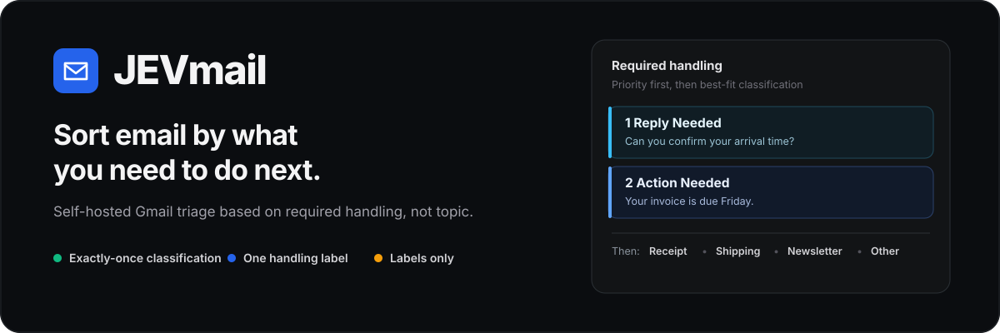
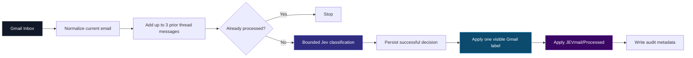

<p align="center">
  
</p>

<p align="center">
  <a href="https://github.com/akeldgord/JEVmail/actions/workflows/ci.yml"></a>
  
  
  
  
  
</p>

<p align="center">
  <strong>Most email classifiers organize your inbox by what messages are about.<br>
  JEVmail organizes it by what you need to do.</strong>
</p>

<p align="center">
  A self-hosted Gmail classifier that assigns one practical handling label to each eligible message.
</p>

---

## The idea

A hotel confirmation and a hotel asking you to confirm your arrival time are both **travel** emails.

But only one needs a reply.

JEVmail asks a different question:

> **What should the user need to do with this email?**

The result is an inbox organized around **handling**, not subject matter.

| Email | JEVmail label | Why |
| --- | --- | --- |
| “Can you confirm your arrival time?” | **Reply Needed** | A legitimate response is expected |
| “Your invoice is due Friday” | **Action Needed** | Something must be done, but replying is not the action |
| “Your hotel booking is confirmed” | **Reservation / Confirmation** | Reference material; no action required |
| “Your package will arrive tomorrow” | **Shipping / Delivery** | Status information |
| “Here’s your paid receipt” | **Receipt / Record** | Keepable record |
| “Can I get 15 minutes to demo our product?” | **Cold Marketing** | A question does not magically make unsolicited outreach Reply Needed |

### The hard rule

**Reply Needed** and **Action Needed** outrank every lower handling category.

That means a reservation asking a real question becomes **Reply Needed**, and an invoice requiring payment becomes **Action Needed**.

---

## Why JEVmail

| | |
| --- | --- |
| **Handling-first** | Classifies by the next thing you need to do, not by topic. |
| **Exactly once** | A durable Gmail marker prevents completed messages from being classified again. |
| **One label per message** | No overlapping classifier labels. |
| **Privacy-first** | Email bodies, thread text, attachments, and classifier payloads are not persisted locally. |
| **Labels only** | v1 does not archive, delete, forward, mark read, or move your mail. |
| **Auditable** | Decisions, probabilities, configuration version, corrections, and usage metadata are inspectable. |
| **Self-hosted** | Your Gmail connection, app state, rate limits, and classifier credentials stay under your control. |
| **Bounded decisions** | The model chooses from your configured taxonomy rather than inventing new categories. |

---

## Handling taxonomy

JEVmail ships with a deliberately small, opinionated default taxonomy:

1. **Reply Needed**
2. **Action Needed**
3. **Reservation / Confirmation**
4. **Receipt / Record**
5. **Account / Security Notice**
6. **Verification / One-Time Code**
7. **Shipping / Delivery**
8. **FYI / No Action**
9. **Newsletter / Subscription**
10. **Cold Marketing**
11. **Political**
12. **Indeterminate**

The visible names and guidance are editable in the dashboard. Optional categories can be disabled or mapped to different Gmail user labels.

Three semantic roles remain protected:

- **Reply Needed**
- **Action Needed**
- **Indeterminate**

JEVmail always resolves a classification to exactly one enabled label or **Indeterminate**.

---

## How it works



### Exactly-once behavior

The hidden Gmail label `JEVmail/Processed` is the durable completion boundary.

A successful classifier result is persisted **before** Gmail reconciliation. If Gmail fails after inference, JEVmail reuses the saved decision on retry instead of paying for a second model call.

Production classifier requests also use a stable idempotency key derived from the Gmail message and classifier configuration.

Changing your classifier settings does **not** silently reclassify completed mail.

---

## Privacy by design

JEVmail is intentionally **not** a shadow mailbox.

The local SQLite database stores operational metadata such as:

- Gmail message and thread IDs
- assigned handling label
- probabilities and confidence
- timestamps
- classifier/model/config version
- processing state
- token/cost metadata when available
- manual correction history

It does **not** persist:

- email bodies
- prior thread text
- sender/subject copies
- attachments or extracted attachment contents
- full classifier payloads containing mail content

When the dashboard needs message content, it fetches it from Gmail on demand.

OAuth refresh tokens are encrypted at rest with AES-256-GCM using `APP_ENCRYPTION_KEY`.

---

## Context without runaway prompts

For each classification JEVmail uses:

- the **current email**
- up to the **three immediately preceding messages** in that Gmail thread
- sender/recipient metadata
- subject
- normalized body text
- attachment filename / MIME type / size metadata

Quoted chains, obvious signatures, HTML noise, and redundant whitespace are stripped before inference.

Attachment contents are **not** inspected in v1.

If the available context is insufficient, the classifier should return **Indeterminate**.

---

## Dashboard

JEVmail includes an operational dashboard for reviewing classifier behavior and processing state.

### Overview
Processing health, classifications today, correction rate, usage, backlog state, last poll, and recent categorized errors.

### Inbox Triage
Recent classifications with probabilities, live Gmail preview, and manual correction.

### Labels
Rename visible labels, edit classifier guidance, enable/disable optional categories, and map classifier categories to Gmail user labels.

### Classifier
Edit global instructions, select a pinned model, inspect the active configuration hash, and run a **no-side-effect test console**.

### Processing
Pause/resume processing, change poll interval and rate limits, set an optional daily spend ceiling, and manage historical backlog jobs.

### Audit
Inspect classification and correction history without persisting email content.

Manual corrections change the Gmail label and preserve an audit trail. They do **not** silently retrain or mutate future classifier behavior.

---

## New mail by default

JEVmail does not process your historical Inbox by default.

On initial setup it records a startup watermark and processes only eligible Inbox messages arriving after that point.

Historical mail is handled through an explicit **Clear Backlog** workflow:

- last 30 days
- last 90 days
- last year
- custom range
- entire current Inbox

Backlog jobs can be paused, resumed, or cancelled. They use the same rate and spend controls as normal processing.

JEVmail estimates eligible messages and expected usage before starting. Cost estimates use **$0.042/MTok input · Free output** when provider-reported billing metadata is unavailable.

---

## Architecture

JEVmail is a modular TypeScript monolith packaged as one image with two processes:

```text
┌────────────────────────────────────────────────────┐
│                    JEVmail                         │
│                                                    │
│  ┌─────────────────┐     ┌─────────────────────┐  │
│  │ Next.js web app │     │ Polling worker      │  │
│  │ Dashboard / API │     │ Gmail + backlog     │  │
│  └────────┬────────┘     └──────────┬──────────┘  │
│           │                         │             │
│           └──────────┬──────────────┘             │
│                      ▼                            │
│                 SQLite state                     │
└──────────────────────┬─────────────────────────────┘
                       │
             ┌─────────┴──────────┐
             ▼                    ▼
          Gmail API            Jev API
```

External systems sit behind adapters. Gmail ingestion and dashboard logic are not tied to one classifier provider.

Runtime persistence currently uses Node's built-in SQLite API with explicit repositories. Drizzle tooling remains in the project as a possible future migration path.

---

# Quick start

## Requirements

- Docker + Docker Compose recommended
- a Google account with Gmail
- a Google Cloud project
- a TypeSafe API key
- a pinned Jev production model identifier

The example configuration uses `jev-1.13.0` against the official TypeSafe API at `https://api.typesafe.ai`.

## 1. Clone and configure

```bash
git clone https://github.com/akeldgord/JEVmail.git
cd JEVmail
cp .env.example .env
```

Generate different random values for `AUTH_SECRET` and `APP_ENCRYPTION_KEY`:

```bash
openssl rand -hex 32
```

Set at minimum:

```dotenv
APP_URL=http://localhost:3000
NEXTAUTH_URL=http://localhost:3000

AUTH_SECRET=<random secret>
APP_ENCRYPTION_KEY=<different random secret>

GOOGLE_CLIENT_ID=<google oauth client id>
GOOGLE_CLIENT_SECRET=<google oauth client secret>

JEVMODEL_API_KEY=<TypeSafe API key>
JEV_MODEL=jev-1.13.0
JEV_BASE_URL=https://api.typesafe.ai
```

## 2. Configure Google OAuth

Use this exact sequence:

1. Create or select a Google Cloud project.
2. Enable the **Gmail API**.
3. Configure the OAuth consent screen.
4. If the consent screen is in **Testing**, add the Gmail account you will use as a test user.
5. Create an **OAuth 2.0 Web application** client.
6. Register the exact redirect URI printed by JEVmail preflight.

For the default local install:

```text
http://localhost:3000/api/auth/callback/google
```

The URI must match `APP_URL` exactly, including scheme, hostname, and port.

Google consent changes can take time to propagate. If you just changed the consent screen or test users and sign-in still fails, wait several minutes before changing unrelated settings.

JEVmail requests `gmail.modify`. After sign-in, JEVmail verifies that Google actually granted that scope. A token without Gmail access is marked as requiring re-authorization instead of failing later during processing.

## 3. Run preflight

Before starting the app:

```bash
docker compose --profile tools run --rm preflight
```

Preflight runs automatically before both the web app and worker start. You can also run it manually.

Preflight:

- validates required environment variables
- rejects the old `jevmodel.org` endpoint
- prints the exact Google redirect URI to register
- sends a tiny classifier request to verify the TypeSafe endpoint, API key, and model

The classifier probe has minimal usage and contains no email content.

## 4. Start JEVmail

```bash
docker compose up -d --build
```

Open:

```text
http://localhost:3000
```

Sign in with the Gmail account you want JEVmail to classify.

### Useful Docker commands

```bash
# Follow web + worker logs
docker compose logs -f

# Run the full test suite inside Docker
docker compose --profile tools run --rm test

# Stop without deleting JEVmail state
docker compose down

# Stop and intentionally delete local JEVmail state
docker compose down -v
```

Deleting the local database does not remove Gmail labels already applied to messages. The Gmail-side processed marker helps protect against accidental reclassification after local-state loss.

### Existing Gmail filters

JEVmail does not continuously fight user-created Gmail filters. If another Gmail filter removes or replaces a JEVmail classification label after a message has been processed, the hidden `JEVmail/Processed` marker remains authoritative and JEVmail will not automatically reclassify that message. This avoids label tug-of-war with user rules.

---

## Processing controls

| Setting | Default |
| --- | ---: |
| Poll interval | 60 seconds |
| Max classifications/minute | 30 |
| Max classifications/hour | 300 |
| Max classifications/day | 2,000 |
| Backlog batch size | 25 |
| Backlog concurrency | 8 |
| Daily spend ceiling | unset |

Minute and hour limits are rolling. Daily count/spend resets on the UTC day boundary.

The spend ceiling is enforced only when reliable provider cost metadata is available.

When a minute, hour, day, or spend limit is reached, JEVmail records the reason and reset time, shows the waiting state in the Processing page, and resumes automatically after the window resets. Backlog jobs use concurrent chunks controlled by `BACKLOG_CONCURRENCY` (default `8`).

Gmail is still the practical ceiling for backlog throughput. Its per-user API quota is much lower than Jev's classifier capacity, so increasing concurrency beyond the default will not produce unlimited throughput and can trigger Gmail quota backpressure.

---

## Classifier configuration

Classifier contract:

> normalized email context + enabled taxonomy → one bounded label + probabilities/confidence/usage

For Jev:

- use a **pinned production model**, not `latest` or a preview alias
- the request uses one bounded `choice` question
- production retries reuse the same idempotency key
- normalized state is deterministically trimmed to stay within the provider state budget

Classifier configurations are versioned immutably. Editing label guidance or global instructions affects only mail that has not already completed classification.

---

## Development

```bash
npm install
```

Run the core suite:

```bash
npm run test:core
```

Run everything, including dashboard smoke tests:

```bash
npm test
```

Run the remaining verification gates:

```bash
npm run lint
npm run typecheck
npm run build
docker compose config --quiet
```

GitHub Actions runs install, lint, typecheck, tests, the production build, and Compose validation without real Gmail or Jev credentials.

Integration tests use fake providers and must never call live Gmail/Jev services.

---

## Deliberate non-goals

JEVmail does **not**:

- archive email
- delete email
- mark messages read or unread
- forward messages
- move messages
- dynamically invent new labels
- assign multiple classifier labels to one message
- inspect attachment contents
- use OCR or vision
- use Gmail Pub/Sub push notifications
- learn automatically from corrections
- automatically reclassify completed messages
- operate as a multi-user hosted SaaS

These are deliberate constraints.

The goal is to keep the classification step useful, inspectable, and safe before automating downstream actions.

---

## Security notes

- Never commit `.env`; it is excluded from git and the Docker build context.
- Use distinct, cryptographically random values for `AUTH_SECRET` and `APP_ENCRYPTION_KEY`.
- OAuth refresh tokens are encrypted before local persistence.
- Use HTTPS for deployments beyond localhost.
- Treat both the SQLite volume and `.env` as sensitive.
- Gmail system labels such as `INBOX`, `TRASH`, and `SPAM` are rejected as classifier mappings.

---

## Status

JEVmail is early software. Its core processing and safety invariants are covered by automated tests.

CI verifies:

- dependency installation
- lint
- TypeScript type checking
- core and UI tests
- production Next.js build
- Docker Compose configuration

Real Gmail and Jev credentials are intentionally not required in CI.

---

<p align="center">
  <strong>JEVmail</strong><br>
  Classify by required handling, not by topic.
</p>
